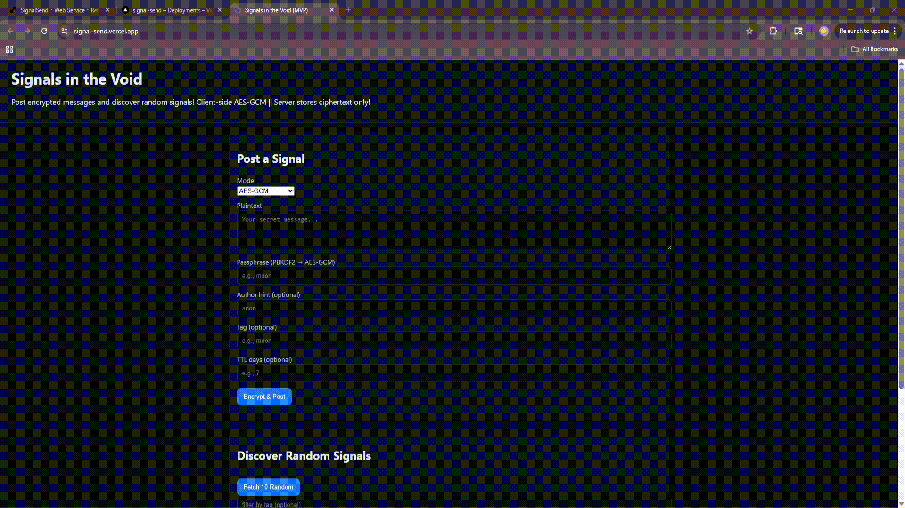

# SignalSend
Siege Week 7 Project: Signal Send!

__NOTE__:
This project is hosted on _React_ which turns on after like a minute of activity bc free plan, so please be patient!

A cool little project where you can both send and recieve signals! 
But you've gotta decypt them :D

One more

Project!

Signals in the Void is a small web app where people can send and discover random encrypted messages. Each message (a “signal”) is encrypted in the browser before being stored on the server, so only those with the right passphrase can decrypt it!

Check out the demo link at the top right try out the project! (Or check the demo vid below: )

__________________________________________________________________________
DEMO VID:

__________________________________________________________________________

Tech Stack:

__HTML/CSS/JS__: the UI in the browser.
__Web Crypto API__: does AES-GCM encryption/decryption in the browser.
__Flask__: simple Python web API to accept and serve signals.
__Flask-CORS__: lets the browser call your API from another domain.
__SQLite__: file-based database to store encrypted signals.
__Render__: hosts the Flask API + keeps the SQLite file on a persistent disk.
__Vercel__: hosts the static frontend (HTML/JS/CSS).

HEY

https://www.youtube.com/watch?v=oHg5SJYRHA0

